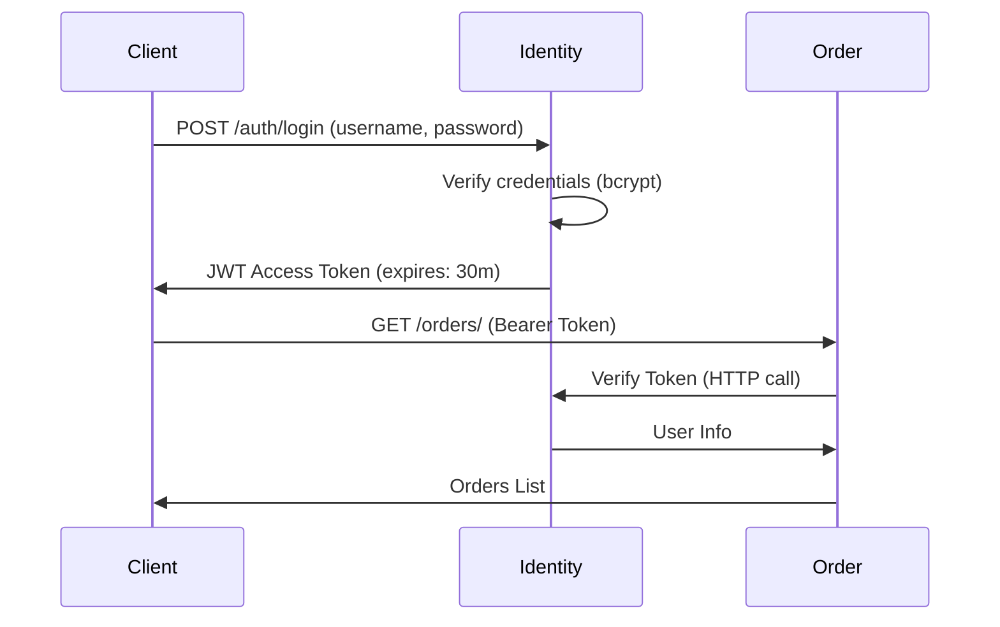

# 🚚 Shipping Center System - AI-Powered Logistics Platform

[](https://www.python.org/)
[](https://fastapi.tiangolo.com/)
[](https://react.dev/)
[](https://www.docker.com/)
[](LICENSE)

## 📋 Tổng quan

Hệ thống quản lý trung tâm vận chuyển thông minh sử dụng **AI Agent (OpenAI GPT-4o-mini)** để tự động tối ưu hóa quy trình logistics end-to-end. Hệ thống tự động phân công shipper, tính toán tuyến đường tối ưu, cân bằng tải giữa các khu vực, và xử lý sự cố khẩn cấp theo thời gian thực.

### 🎯 Vấn đề giải quyết

- **Tối ưu hóa Last Mile Delivery**: Tự động ghép đơn hàng với shipper gần nhất dựa trên GPS real-time
- **Middle Mile Optimization**: Tính toán route Hub ↔ Satellite tối ưu sử dụng Goong Maps API
- **Dynamic Resource Balancing**: Tự động điều phối shipper giữa các khu vực quá tải
- **Emergency Response**: Xử lý sự cố (tai nạn, xe hỏng) và điều phối shipper cứu hộ trong < 5 giây

## ✨ Tính năng nổi bật

### 🤖 AI-Powered Optimization Engine

#### **Intelligent Agent (OpenAI Function Calling)**
```python
# Agent tự động thực thi 2 giai đoạn tối ưu hóa:
Phase 1 (First Mile): SME → Hub
  ├─ Quét đơn hàng pending
  ├─ Tìm shipper gần nhất (GPS Real-time)
  ├─ Tính toán route tối ưu (Goong API)
  └─ Batch assignment (1 lượt)

Phase 2 (Middle Mile): Hub → Satellite → Customer
  ├─ Quét backlog tại Hub
  ├─ Group đơn theo destination
  ├─ Tìm satellite gần receiver nhất
  └─ Assign truck cho multi-stop route
```

#### **Emergency Incident Handler**
- Phát hiện sự cố từ tin nhắn shipper (NLP)
- Tìm shipper cứu hộ gần nhất trong bán kính 15km
- Chuyển đơn hàng tự động + thông báo cho cả 2 bên
- Cập nhật trạng thái shipper gặp nạn → OFFLINE

### 📦 Quản lý đơn hàng

- **3-Leg Journey Tracking**: Pickup → Transfer → Delivery
- **Barcode/QR System**: Quét để xác nhận từng điểm chuyển giao
- **Real-time Status**: WebSocket updates cho admin dashboard
- **Distance Calculation**: Goong API tính khoảng cách thực tế (không chim bay)
- **Auto Fee Calculation**: Phí vận chuyển dựa trên khoảng cách + trọng lượng

### 🚛 Quản lý Shipper & Fleet

- **GPS Background Tracking**: Expo Location Service (update mỗi 30s)
- **Multi-vehicle Support**: Motorbike (Last Mile) + Truck (Middle Mile)
- **Smart Assignment**: Dựa trên capacity, workload, GPS location
- **Shift Management**: Check-in/out, break time, overtime
- **Performance Analytics**: Delivery rate, average time, distance covered

### 🏢 Warehouse Management

- **Hub vs Satellite**: Phân biệt entry point (Hub) và exit point (Satellite)
- **Inventory Tracking**: Real-time stock levels
- **Transfer Queue**: Danh sách đơn chờ transfer tại mỗi Hub
- **Capacity Management**: Cảnh báo khi Hub quá tải

## 🏗️ Kiến trúc hệ thống

### Microservices Architecture

```
┌─────────────────────────────────────────────────────────────┐
│                      Client Layer                            │
├───────────────────────┬─────────────────────────────────────┤
│  React Web (Vite)     │  React Native Mobile (Expo)         │
│  Admin Dashboard      │  Shipper App                        │
│  Port: 3000           │  Android/iOS                        │
└───────────────────────┴─────────────────────────────────────┘
                              ▼
┌─────────────────────────────────────────────────────────────┐
│                   Service Layer (FastAPI)                    │
├──────────────────┬──────────────────┬───────────────────────┤
│  Identity (8000) │  Order (8001)    │  AI Agent (8002)      │
│  - Auth (JWT)    │  - Orders        │  - GPT-4o-mini        │
│  - Users/Roles   │  - Journey Legs  │  - Function Calling   │
│  - SME/Shipper   │  - Barcode Scan  │  - Route Optimization │
│  - Employees     │  - Push Notif    │  - Incident Handler   │
└──────────────────┴──────────────────┴───────────────────────┘
                              ▼
┌─────────────────────────────────────────────────────────────┐
│          MySQL 8.0 Database (Port 3307)                      │
│  - Users, Roles, Permissions                                │
│  - Orders, OrderJourneyLegs                                 │
│  - Warehouses (Hub/Satellite), Areas                        │
│  - Shippers, Vehicles, GPS Logs                             │
└─────────────────────────────────────────────────────────────┘
                              ▼
┌─────────────────────────────────────────────────────────────┐
│                   External APIs                              │
│  - Goong Maps (Distance Matrix, Geocoding)                  │
│  - Firebase Cloud Messaging (Push Notifications)            │
│  - OpenAI API (GPT-4o-mini Function Calling)                │
└─────────────────────────────────────────────────────────────┘
```

### Service Responsibilities

| Service | Port | Tech Stack | Responsibilities |
|---------|------|------------|------------------|
| **Identity Service** | 8000 | FastAPI + SQLAlchemy | Authentication, User Management, RBAC |
| **Order Service** | 8001 | FastAPI + Firebase | Order CRUD, Journey Tracking, Barcode Scanner, Push Notifications |
| **AI Agent Service** | 8002 | FastAPI + OpenAI + Goong API | Route Optimization, Auto Assignment, Incident Response |
| **Web Frontend** | 3000 | React 18 + Vite + Shadcn/UI | Admin Dashboard, SME Portal, Real-time Map |
| **Mobile App** | - | React Native + Expo | Shipper App, GPS Tracking, Barcode Scanner |

## 🛠️ Tech Stack

### Backend Services

```yaml
Framework: FastAPI 0.104+
Language: Python 3.11+
Database: MySQL 8.0
ORM: SQLAlchemy 2.0 (Async)
Authentication: JWT (PyJWT) + OAuth2
AI Engine: OpenAI GPT-4o-mini (Function Calling)
Maps API: Goong Distance Matrix API
Push Notifications: Firebase Cloud Messaging
Containerization: Docker + Docker Compose
```

### Frontend Applications

```yaml
Web:
  - Framework: React 18 + TypeScript
  - Build Tool: Vite 5
  - UI Library: Shadcn/UI + Radix UI
  - Maps: MapLibre GL JS
  - State: React Hooks + Context API
  - HTTP: Axios

Mobile:
  - Framework: React Native 0.74 + Expo 51
  - Styling: NativeWind (TailwindCSS)
  - Navigation: Expo Router
  - Maps: MapLibre React Native
  - GPS: Expo Location + Task Manager
  - Camera: Expo Camera (Barcode Scanner)
```

### DevOps & Tools

```yaml
Container Orchestration: Docker Compose
Database Migration: Alembic
Testing: Pytest (Backend), Playwright (Frontend E2E)
API Documentation: FastAPI Auto-generated Swagger
Logging: Python logging + uvicorn
```

## 📦 Cấu trúc thư mục

```
shipping-center-system/
│
├── services/                           # Backend Microservices
│   ├── identity-service/              # Port 8000 - Auth & User Management
│   │   ├── app/
│   │   │   ├── api/v1/endpoints/     # REST API Endpoints
│   │   │   │   ├── auth.py           # Login, Register, Token
│   │   │   │   ├── users.py          # User CRUD
│   │   │   │   ├── sme.py            # SME Management
│   │   │   │   ├── employee.py       # Employee CRUD
│   │   │   │   └── Shipper.py        # Shipper CRUD
│   │   │   ├── core/
│   │   │   │   ├── config.py         # Settings (Pydantic)
│   │   │   │   └── security.py       # JWT, Password Hashing
│   │   │   ├── crud/                 # Database Operations
│   │   │   ├── db/
│   │   │   │   ├── mysql_connection.py
│   │   │   │   └── session.py        # SQLAlchemy Session
│   │   │   ├── models/               # SQLAlchemy Models
│   │   │   │   ├── user.py
│   │   │   │   ├── sme.py
│   │   │   │   └── shipper.py
│   │   │   └── schemas/              # Pydantic Schemas
│   │   ├── Dockerfile
│   │   └── requirements.txt
│   │
│   ├── order-service/                 # Port 8001 - Order & Journey
│   │   ├── app/
│   │   │   ├── api/v1/endpoints/
│   │   │   │   ├── order.py          # Order CRUD
│   │   │   │   ├── journey.py        # Journey Tracking
│   │   │   │   ├── scan.py           # Barcode Scanner
│   │   │   │   ├── barcode.py        # Generate Barcode
│   │   │   │   └── public.py         # Public Tracking API
│   │   │   ├── services/
│   │   │   │   ├── goong_service.py  # Goong API Client
│   │   │   │   └── notification_service.py # Firebase FCM
│   │   │   ├── core/
│   │   │   │   └── firebase.py       # Firebase Init
│   │   │   └── ...
│   │   └── ...
│   │
│   └── ai-agent-service/              # Port 8002 - AI Optimization
│       ├── app/
│       │   ├── api/v1/endpoints/
│       │   │   └── agent.py          # Agent Trigger Endpoints
│       │   ├── services/
│       │   │   └── IntelligentLogisticsAI.py  # 🧠 Main AI Agent
│       │   ├── models/               # Shared SQLAlchemy Models
│       │   └── crud/
│       └── ...
│
├── FE/AI-Powered-Transportation-Hub-for-SMEs/  # Web Frontend (Port 3000)
│   ├── src/
│   │   ├── components/               # Reusable UI Components
│   │   │   ├── ui/                  # Shadcn/UI Base Components
│   │   │   ├── OrderTable.tsx
│   │   │   ├── MapView.tsx
│   │   │   └── Dashboard.tsx
│   │   ├── pages/                   # Route Pages
│   │   │   ├── LoginPage.tsx
│   │   │   ├── DashboardPage.tsx
│   │   │   ├── OrdersPage.tsx
│   │   │   └── TrackingPage.tsx
│   │   ├── services/
│   │   │   ├── api.ts               # Axios Instance
│   │   │   ├── authService.ts
│   │   │   └── orderService.ts
│   │   ├── hooks/                   # Custom React Hooks
│   │   └── styles/
│   ├── Dockerfile
│   └── package.json
│
├── apps/shipping-app/                # Mobile App (React Native)
│   ├── app/                         # Expo Router Pages
│   │   ├── _layout.tsx
│   │   ├── index.tsx                # Login Screen
│   │   ├── (tabs)/                  # Tab Navigation
│   │   │   ├── home.tsx             # Assigned Orders
│   │   │   ├── map.tsx              # Live Map
│   │   │   └── profile.tsx
│   │   ├── (warehouse)/             # Warehouse Screens
│   │   │   └── scan.tsx             # Barcode Scanner
│   │   ├── pickup/
│   │   │   └── [id].tsx             # Pickup Detail
│   │   └── schedule/
│   │       └── index.tsx            # Shift Management
│   ├── components/
│   │   ├── OrderCard.tsx
│   │   ├── TimelineItem.tsx
│   │   ├── ScanConfirmModal.tsx
│   │   └── ActionButton.tsx
│   ├── lib/
│   │   ├── api.ts                   # API Client
│   │   ├── types.ts                 # TypeScript Types
│   │   └── usePushNotifications.ts  # FCM Hook
│   └── package.json
│
├── docker-compose.yml               # Docker Orchestration
├── init.sql                         # Database Schema
└── README.md                        # This File
```

## 🚀 Cài đặt & Chạy

### Prerequisites

```bash
# Required
- Docker Desktop (Windows/Mac) hoặc Docker Engine (Linux)
- Docker Compose v2.0+

# Optional (cho local development)
- Node.js 18+
- Python 3.11+
- MySQL 8.0
```

### Bước 1: Clone Repository

```bash
git clone https://github.com/your-username/shipping-center-system.git
cd shipping-center-system
```

### Bước 2: Cấu hình Environment Variables

Tạo file `.env` trong thư mục gốc:

```env
# Database
DB_HOST=db_logistics
DB_PORT=3306
DB_USER=root
DB_PASSWORD=your_secure_password
DB_NAME=cuoiki_soa

# JWT Secret (tối thiểu 32 ký tự)
SECRET_KEY=your_very_long_secret_key_at_least_32_characters_long_12345

# OpenAI API (để sử dụng AI Agent)
OPENAI_API_KEY=sk-proj-xxxxxxxxxxxxxxxxxxxxxx

# Goong Maps API (đăng ký tại: https://goong.io)
GOONG_API_KEY=your_goong_api_key_here

# Firebase (cho Push Notifications)
FIREBASE_PROJECT_ID=your-firebase-project-id
FIREBASE_PRIVATE_KEY=your-firebase-private-key
```

> ⚠️ **Lưu ý**: File `.env` đã được thêm vào `.gitignore`. Không commit API keys lên Git!

### Bước 3: Khởi động toàn bộ hệ thống (Docker Compose)

```bash
# Build và chạy tất cả services
docker-compose up --build

# Hoặc chạy ở chế độ background
docker-compose up -d

# Xem logs real-time
docker-compose logs -f

# Xem logs của 1 service cụ thể
docker-compose logs -f ai-agent
```

### Bước 4: Kiểm tra trạng thái

```bash
# Kiểm tra containers đang chạy
docker-compose ps

# Output mong đợi:
# NAME                    STATUS              PORTS
# db_logistics_container  Up 2 minutes        0.0.0.0:3307->3306/tcp
# identity_service        Up 1 minute         0.0.0.0:8000->8000/tcp
# order_service           Up 1 minute         0.0.0.0:8001->8001/tcp
# ai_agent_service        Up 1 minute         0.0.0.0:8002->8002/tcp
# react_frontend          Up 1 minute         0.0.0.0:3000->80/tcp
```

### Bước 5: Truy cập ứng dụng

| Service | URL | Mô tả |
|---------|-----|-------|
| 🌐 **Web Dashboard** | http://localhost:3000 | Admin & SME Portal |
| 📘 **Identity API Docs** | http://localhost:8000/docs | Swagger UI - Auth Service |
| 📗 **Order API Docs** | http://localhost:8001/docs | Swagger UI - Order Service |
| 📙 **AI Agent API Docs** | http://localhost:8002/docs | Swagger UI - AI Service |
| 🗄️ **MySQL Database** | `localhost:3307` | User: `root` / Pass: `your_password` |

### Bước 6: Chạy Mobile App (Development)

```bash
cd apps/shipping-app

# Cài đặt dependencies
npm install

# Start Expo Dev Server
npx expo start

# Chọn platform:
# - Nhấn 'a' để chạy trên Android Emulator
# - Nhấn 'i' để chạy trên iOS Simulator
# - Quét QR code bằng Expo Go app để test trên thiết bị thật
```

## 🧪 Testing

### Backend Unit Tests

```bash
# Test Identity Service
cd services/identity-service
pytest tests/ -v

# Test Order Service
cd services/order-service
pytest tests/ -v --cov=app
```

### Frontend E2E Tests (Playwright)

```bash
cd FE/AI-Powered-Transportation-Hub-for-SMEs

# Cài đặt Playwright browsers (lần đầu)
npx playwright install

# Chạy E2E tests
npx playwright test

# Chạy với UI mode (interactive)
npx playwright test --ui

# Xem report
npx playwright show-report
```

### API Testing (Manual - Swagger UI)

1. Mở http://localhost:8000/docs
2. Click **"Authorize"** button
3. Login để lấy access token:
   ```bash
   POST /api/v1/auth/login
   {
     "username": "admin",
     "password": "admin123"
   }
   ```
4. Copy `access_token` từ response
5. Paste vào ô **"Value"** trong popup Authorize
6. Test các endpoints khác

## 📚 API Documentation

### Identity Service (`/api/v1/`)

#### Authentication
```http
POST /auth/login
POST /auth/register
POST /auth/refresh
GET  /auth/me
```

#### User Management
```http
GET    /users/
GET    /users/{user_id}
POST   /users/
PUT    /users/{user_id}
DELETE /users/{user_id}
```

#### SME Management
```http
GET    /sme/
GET    /sme/{sme_id}
POST   /sme/
PUT    /sme/{sme_id}
```

#### Shipper Management
```http
GET    /shipper/
GET    /shipper/{shipper_id}
POST   /shipper/
PUT    /shipper/{shipper_id}/location  # Update GPS
```

### Order Service (`/api/v1/`)

#### Order Management
```http
GET    /orders/                      # List all orders
GET    /orders/{order_id}            # Order detail
POST   /orders/                      # Create order
PUT    /orders/{order_id}            # Update order
DELETE /orders/{order_id}            # Cancel order
```

#### Journey Tracking
```http
GET    /journey/{order_id}           # Get journey legs
POST   /journey/{order_id}/start     # Start journey
PUT    /journey/legs/{leg_id}/complete  # Complete leg
```

#### Barcode System
```http
POST   /scan/                        # Scan barcode (updates leg status)
POST   /barcode/generate             # Generate barcode for order
```

#### Public API (No Auth)
```http
GET    /public/track/{tracking_code} # Public order tracking
```

### AI Agent Service (`/api/v1/`)

```http
POST   /agent/optimize               # Trigger optimization
POST   /agent/incident               # Report incident
GET    /agent/status                 # Agent health check
```

#### Request Example: Optimize Area

```bash
curl -X POST "http://localhost:8002/api/v1/agent/optimize" \
  -H "Content-Type: application/json" \
  -d '{
    "area_id": "AREA-001",
    "mode": "auto"
  }'
```

#### Request Example: Report Incident

```bash
curl -X POST "http://localhost:8002/api/v1/agent/incident" \
  -H "Content-Type: application/json" \
  -d '{
    "shipper_id": "SH-001",
    "message": "Xe bị hỏng, không thể giao hàng",
    "latitude": 10.7769,
    "longitude": 106.7009
  }'
```

## 🧠 AI Agent - Chi tiết hoạt động

### System Prompt

```python
You are an Intelligent Logistics Coordinator AI Agent.
Your mission: Optimize Logistics Operations AND Handle Emergency Incidents.

PRIORITY 0: EMERGENCY INCIDENT HANDLING
IF user reports problem (e.g., "broken bike", "accident"):
  → Call report_incident_tool immediately
  → Find nearest rescuers
  → Transfer orders
  → END session

STANDARD EXECUTION (if no incident):

Phase 1 (First Mile - Last Mile):
  1. get_pending_orders_tool(area_id)
  2. For each order:
     - find_nearest_shippers_tool(area_id, sme_lat, sme_lon)
     - Match order → nearest shipper
  3. process_batch_assignments_tool(assignments)

Phase 2 (Middle Mile):
  1. get_area_transfer_queue_tool(area_id)
  2. Group orders by destination
  3. get_trucks_in_area_tool(area_id)
  4. assign_batch_to_truck_tool(truck_id, order_ids)
```

### Available Tools (Function Calling)

| Tool Name | Mô tả | Khi nào gọi |
|-----------|-------|-------------|
| `get_pending_orders_tool` | Lấy đơn hàng chưa assign | Đầu Phase 1 |
| `get_available_shippers_tool` | Lấy shipper rảnh | Phase 1 |
| `find_nearest_shippers_tool` | Tìm shipper gần nhất (GPS) | Cho mỗi đơn hàng |
| `process_batch_assignments_tool` | Thực thi phân công hàng loạt | Cuối Phase 1 |
| `get_area_transfer_queue_tool` | Quét Hub tìm đơn chờ transfer | Đầu Phase 2 |
| `get_trucks_in_area_tool` | Lấy xe tải rảnh | Phase 2 |
| `assign_batch_to_truck_tool` | Assign đơn cho truck | Phase 2 |
| `optimize_hub_routing_tool` | Tính route Hub → Satellite tối ưu | On-demand |
| `rebalance_shippers_tool` | Điều shipper từ Area khác | Khi quá tải |
| `report_incident_tool` | Xử lý sự cố khẩn cấp | Khi có incident |

### Workflow Example

```
User Input: "Optimize AREA-001"

Agent Execution:
├─ Turn 1: get_pending_orders_tool("AREA-001")
│   → Returns: 15 orders
│
├─ Turn 2: find_nearest_shippers_tool() for each order
│   → Matches orders to shippers
│
├─ Turn 3: process_batch_assignments_tool(assignments)
│   → Creates journey legs (Pickup → Transfer → Delivery)
│   → Status: SUCCESS (15/15 assigned)
│
├─ Turn 4: get_area_transfer_queue_tool("AREA-001")
│   → Returns: 0 orders (Pickup chưa complete)
│   → Skips Phase 2
│
└─ Turn 5: Agent reports "ALL TASKS COMPLETED"
```

## 🔒 Bảo mật

### Authentication Flow



### Security Features

- ✅ **Password Hashing**: bcrypt với salt rounds = 12
- ✅ **JWT Tokens**: 
  - Access Token: 30 phút
  - Refresh Token: 7 ngày
- ✅ **CORS**: Whitelist domains (không dùng `*` ở production)
- ✅ **SQL Injection Protection**: SQLAlchemy ORM
- ✅ **Role-Based Access Control (RBAC)**:
  - `ADMIN`: Full access
  - `SME`: Tạo đơn, xem đơn của mình
  - `SHIPPER`: Xem đơn được assign, update status
  - `CUSTOMER`: Track đơn hàng (public API)

### Environment Variables Best Practices

```bash
# ❌ KHÔNG làm thế này:
OPENAI_API_KEY=sk-proj-abc123  # Hardcoded trong code

# ✅ Làm thế này:
# 1. Lưu trong .env (local)
# 2. Lưu trong Docker secrets (production)
# 3. Sử dụng AWS Secrets Manager / Azure Key Vault (cloud)
```

## 📊 Database Schema

### Core Tables

```sql
-- Users & Authentication
Users (user_id, username, email, password_hash, role)
Roles (role_id, role_name, permissions)

-- Business Entities
SMEs (sme_id, business_name, latitude, longitude, area_id)
Areas (area_id, name, center_latitude, center_longitude)
Warehouses (warehouse_id, name, type [HUB/SATELLITE], area_id)

-- Workforce
Employees (employee_id, full_name, warehouse_id)
Shippers (shipper_id, employee_id, vehicle_type, status, current_lat, current_lon)

-- Orders
Orders (order_id, sme_id, receiver_address, receiver_lat, receiver_lon, status)
OrderJourneyLegs (id, order_id, sequence, leg_type [PICKUP/TRANSFER/DELIVERY], 
                  assigned_shipper_id, origin_warehouse_id, destination_warehouse_id,
                  status, estimated_distance, started_at, completed_at)
```

### Relationships

```
SME ──1:N─→ Orders
Order ──1:N─→ OrderJourneyLegs
Shipper ──1:N─→ OrderJourneyLegs (assigned_shipper_id)
Warehouse ──1:N─→ OrderJourneyLegs (origin/destination)
Area ──1:N─→ SMEs, Warehouses, Shippers
```

## 🚧 Troubleshooting

### Issue 1: Container khởi động thất bại

```bash
# Kiểm tra logs
docker-compose logs db_logistics

# Xóa volumes cũ và rebuild
docker-compose down -v
docker-compose up --build
```

### Issue 2: Database connection refused

```bash
# Chờ MySQL khởi động hoàn toàn
docker-compose up db_logistics
# Đợi log "ready for connections" (thường 30-60s)
# Sau đó mới start các service khác
docker-compose up identity order ai-agent
```

### Issue 3: OpenAI API Key Invalid

```bash
# Kiểm tra key trong container
docker-compose exec ai-agent env | grep OPENAI

# Nếu không có, thêm vào docker-compose.yml:
services:
  ai-agent:
    environment:
      - OPENAI_API_KEY=${OPENAI_API_KEY}
```

### Issue 4: Mobile App không connect được API

```bash
# Nếu test trên thiết bị thật (không phải emulator):
# 1. Đổi API URL từ localhost → IP máy tính
# File: apps/shipping-app/lib/api.ts
const API_BASE_URL = "http://192.168.1.100:8001"; # Thay bằng IP máy bạn

# 2. Mở firewall cho port 8000, 8001, 8002
# Windows: Settings → Firewall → Allow app
```

## 🤝 Đóng góp

Chúng tôi hoan nghênh mọi đóng góp! Vui lòng làm theo các bước sau:

1. **Fork** repository này
2. Tạo **branch mới** cho feature:
   ```bash
   git checkout -b feature/ten-tinh-nang-moi
   ```
3. **Commit** changes:
   ```bash
   git commit -m "feat: thêm chức năng ABC"
   ```
4. **Push** lên branch:
   ```bash
   git push origin feature/ten-tinh-nang-moi
   ```
5. Tạo **Pull Request** trên GitHub

### Commit Message Convention

```
feat: Thêm tính năng mới
fix: Sửa bug
docs: Cập nhật documentation
style: Format code (không ảnh hưởng logic)
refactor: Tái cấu trúc code
test: Thêm tests
chore: Cập nhật dependencies, config
```

## 📝 Roadmap

### Version 1.0 (Current)
- [x] AI-powered route optimization
- [x] Real-time GPS tracking
- [x] Barcode scanning system
- [x] Emergency incident handling
- [x] Push notifications

### Version 1.1 (Planned)
- [ ] Multi-language support (EN/VI)
- [ ] Advanced analytics dashboard
- [ ] Shipper performance scoring
- [ ] Customer rating system
- [ ] WhatsApp/Zalo integration for notifications

### Version 2.0 (Future)
- [ ] Machine Learning cho predictive demand
- [ ] IoT integration (temperature sensors cho hàng lạnh)
- [ ] Blockchain cho proof of delivery
- [ ] GraphQL API
- [ ] Mobile app cho Customer

## 📄 License


Copyright © 2025 Shipping Center System Team. All rights reserved.

## 👥 Contributors

<table>
  <tr>
    <td align="center">
      <a href="https://github.com/yourusername">
        
        <br />
        <sub><b>Your Name</b></sub>
      </a>
      <br />
      <sub>Lead Developer</sub>
    </td>
  </tr>
</table>

## 📞 Contact & Support

- **Email**: your.email@example.com
- **GitHub Issues**: [Report Bug](https://github.com/your-repo/issues)
- **Documentation**: [Wiki](https://github.com/your-repo/wiki)

---

<p align="center">
  Made with ❤️ for <b>Service-Oriented Architecture Course</b>
  <br />
  <sub>Nếu dự án hữu ích, hãy cho một ⭐ nhé!</sub>
</p>
